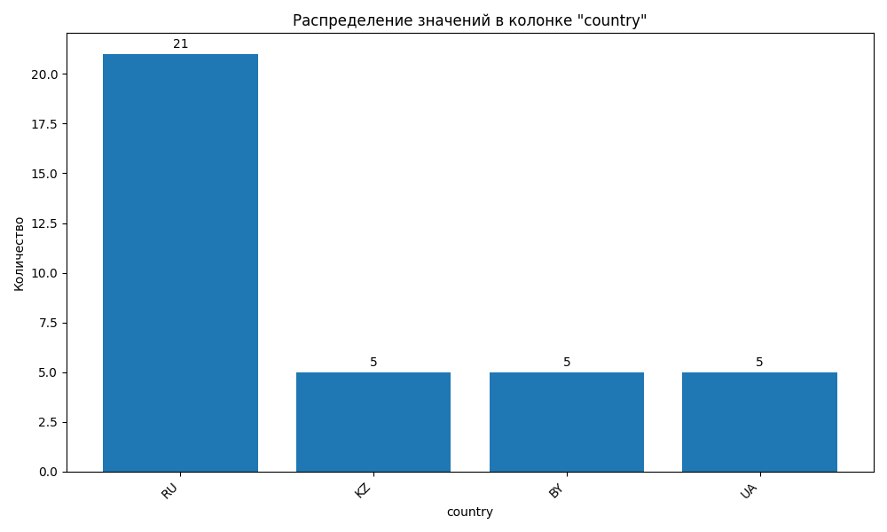

# EDA-отчёт

Сгенерировано: 2025-11-28 23:35:31

Исходный файл: `example.csv`

Строк: **36**, столбцов: **14**

## Качество данных (эвристики)

- Оценка качества: **0.74**
- Макс. доля пропусков по колонке: **5.56%**
- Слишком мало строк: **True**
- Слишком много колонок: **False**
- Слишком много пропусков: **False**
- Константные колонки: **False**
- Высокая кардинальность категориальных признаков: **False**

### Параметры отчёта

- Отображается топ-10 категорий для категориальных признаков
- Колонки с долей пропусков > 10% считаются проблемными

## Колонки

См. файл `summary.csv`.

## Пропуски

См. файлы `missing.csv` и `missing_matrix.png`.

## Корреляция числовых признаков

См. `correlation.csv` и `correlation_heatmap.png`.

## Категориальные признаки

Отображены топ-10 значений для каждой категориальной колонки.

См. файлы в папке `top_categories/`.

## Гистограммы числовых колонок

Показаны гистограммы для первых 6 числовых колонок.

См. файлы `hist_*.png`.

## Распределение категориальных признаков

Дополнительные визуализации распределения категорий:

### country

### city

